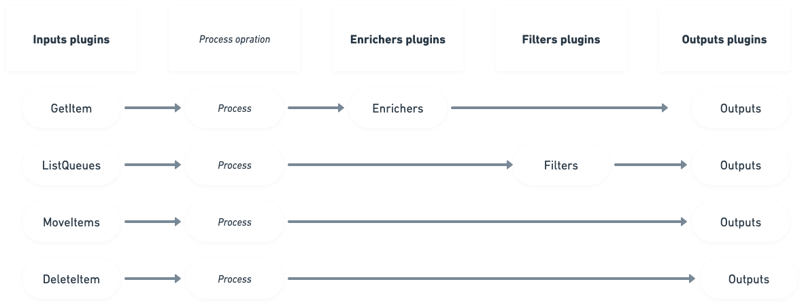

# Sqser

---


Sqser is a http server for processing, monitoring, enriching, filtering, deleting and moving Amazon SQS items. The tool
is designed to interact with Deathletter (DLQ) queues. Based on a plugin system to enable developers in the community to
easily add support for additional plugins.

Sqser supports four core functionalities:

1. Get and item from DLQ and enrich it with data from different sources.
2. List all non empty DLQs
3. Redrive Items from DLQ back to the Queue
4. Delete and Item from DLQ by receipt handle

## 🏗️ Sqser architecture


Sqser loads the required plugins from the config.yaml file. Read more in the configuration section. Sqser supports
running multiple plugins from each type. For example, we could use 'slack' as an input plugin. Invoking listQueues
action would result in a list of non empty dlqs. Then we could pass it through a allowList filter plugin to filter for
example only dlq's with 'staging' prefix. Then pass through blockList plugin to filter out queues that have '
development' in them. many filters are used int he example Lastly, the filtered list can be sent back to all the inputs
activated in the conf file.

### Http Sqser EntryPoint

Sqser's only entry point is a simple http server. It has
four [endpoints](https://github.com/elithe1/sqser/blob/master/main.go) that are used for the four different functions:

```go
http.HandleFunc("/get-item", a.GetItem)
http.HandleFunc("/delete-item", a.DeleteItem)
http.HandleFunc("/move-items", a.MoveItems)
http.HandleFunc("/list-items", a.ListItems)
```

**Important note**: as we can run multiple input plugins in the same time, the sqser decides which plugin should be
invoked based on the query param with the plugin name which is mandatory:
`input=pluginName`

## 📄 The conf file to rule the Sqser

Sqser can have many plugins, but if they are not stated in the conf file with the correct configuration, the Sqser won't
load them and they won't be invoked. The config.yaml file is located in the config folder. It consists of a few sctions:

##### 1. substrings: general Sqser setup

You probably have some conventions for your queue name and the substring section is here to help us generalise it.<br>
Params:

1. `dlq` param is the subsctring you will usually have to mark DLQ queues. It's a safegaurd that we are not mistakenly
   doing operations on non dlqs
2. `environments` is a list of envrinments names. Sqser supports resolving environments from queue names from queues if
   provided in this params.

##### 2. inputs: Specify the different input plugins and their values.

Each input has it's own detailed docs. In general inputs can be sync, don't return until all processing is done (can
take a few seconds).
<br>Or they can also be async. That means, when invoked, they return as fast as possible and then all processing is done
async and response is sent to a return url.

##### 3. enrichers: are used together with `getItem` to enrich it

Each enricher has it's own relevant docs<br>
Enrichers currently return a link. For example a link directly to relevant logs.

##### 4. filters: are used together with `listQueues`

Each filter has it's own relevant docs. The filters purpose is to filter non relevant items from the list before
returning them For example, if the `listQueues` is invoked from a slack channal named 'staging-errors' then we might
want to filter out only staging dlqs and send them back<br>
Filters can have arbitrary values as needed to the filter

##### 5. outputs: Specify the different output plugins and their values.

Each output has it's own detailed docs.

To read more about the conf file and its structure, head
to [CONFIG.md](http://github.com/elithe1/sqser/blob/master/docs/CONFIG.md)

Example conf file with all different sections:

```yaml
substrings:
  dlq: "-dlq"
  environments:
    - staging
    - production

inputs:
  - name: slack
    async: true

filters:
  - name: substringAllowList
    values:
      - dlq
  - name: substringBlockList
    values:
      - developer # no dev queues should be returned :)
  - name: slackChannelId
    values:
      - name: staging
        id: C03QH16LBEJ
      - name: production
        id: C02LER699FX

enrichers:
  - name: logzio
    values:
      accounts:
        - name: staging
          id: 499492
        - name: production
          id: 499512
      enrichFields:
        timeStamp: timestamp # Currently, support only high level non-nested fields
        searchField: traceId # Currently, support only high level non-nested fields

outputs:
  - name: slack
```

## 🔌 Available plugins

### inputs:

- A plugin that recives commands from a slack slash command app
  integration. [slack slash command plugin](https://github.com/elithe1/sqser/blob/master/plugins/inputs/slack/README.md)

### Filters:

- Filter that chooses only dlqs that match the originating slack channel
  env. [slackChanId](https://github.com/elithe1/sqser/blob/master/plugins/filters/slackChanId/README.md)
- Filter that chooses only dlqs that have a
  substring [substringAllowList](https://github.com/elithe1/sqser/blob/master/plugins/filters/substringAllowList/README.md)
- Filter that removes all dlqs that have specified
  substrings [substringBlockList](https://github.com/elithe1/sqser/blob/master/plugins/filters/substringBlockList/README.md)

### Enrichers:

- Enriches the item with direct link to relevant
  logs [logzio](https://github.com/elithe1/sqser/blob/master/plugins/enrichers/logzio/README.md)

### Outputs:

- Prints to slack response url the results of the
  commands [slack output plugin](https://github.com/elithe1/sqser/blob/master/plugins/outputs/slack/README.md)

### 🔌 Adding new plugins

Honestly, just copy and existing plugin of the same type, and try to change stuff and follow the guidelines 😅

1. [Input plugin](https://github.com/elithe1/sqser/blob/master/docs/INPUTS.md)
1. [Filter plugin](https://github.com/elithe1/sqser/blob/master/docs/FILTERS.md)
1. [Enricher plugin](https://github.com/elithe1/sqser/blob/master/docs/ENRICHERS.md)
1. [Output plugin](https://github.com/elithe1/sqser/blob/master/docs/OUTPUTS.md)
