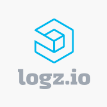

# Logz.io Enricher Plugin

[Logz.io](https://logz.io/) is a log (and more) SaaS. 
This plugin enriches the item from getItem command with a direct link to logs. It's implemented in the way that the
enricher is looking at high level fields in the item fetched from the dlq. Then tries to build a link using the field
that has the timestamp and another search field.

## Configuration

Values must have:

- **accounts**: as the account the log is going to are part of the link we will have to provide account names (must
  match environment names) and account ids that will be inserted in the link.
- **enrichFields**: the name of the `timestamp` and the `searchField` in the sqs message to fill them in for accurate
  search of the logs 
