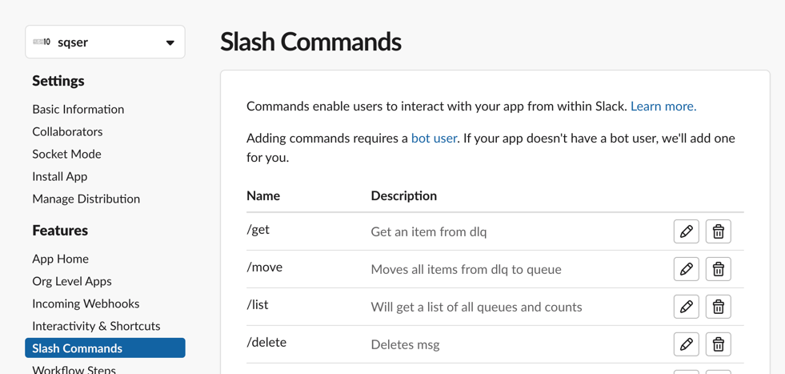
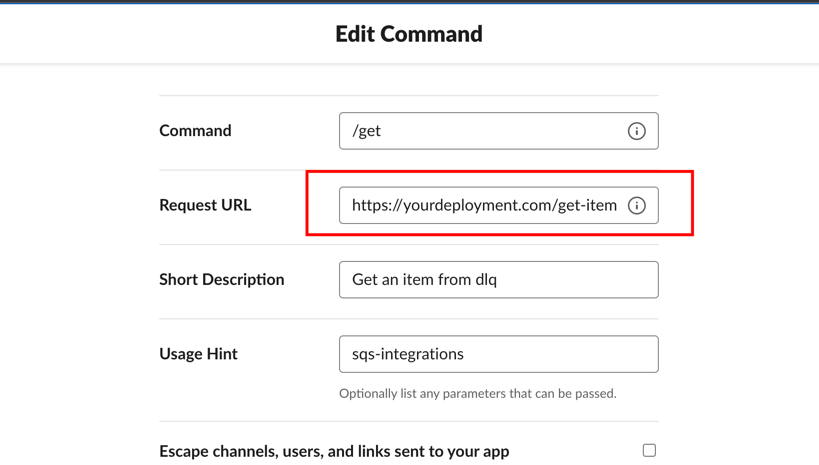

# Slack Input Plugin

The Slack input plugin allows a slack app to be added to specific channels and triggering the different functions using
slash commands.<br>
Slack slash commands has to return in less than 3 sec.<br>
Therefore we are going to only parse the information from the slack payload into the correct structs and return

# How to install Slack (The Slack part)?

- Head to [slack apps](https://api.slack.com/apps).
- Create new app
- Assign it to your slack workspace
- Choose slash commands in the menu
- Create commands for all four functions 
- Attach methods to commands 

## Configuration

```yaml @sample.yaml
inputs: # general inputs section
  - name: slack 
    async: true # slack is an async plugin
```
